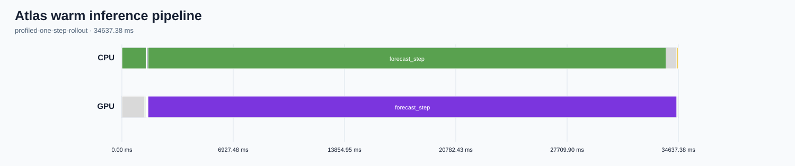

# Atlas inference performance analysis

Status: recommendation-only analysis. No model or Earth2Studio implementation was changed.

## Executive summary

Warm Atlas inference on one H100 takes a median **32,883.8 ms per six-hour forecast step** and **100,437.6 ms end-to-end for three steps**. The nine measured steps are stable (24.3 ms standard deviation, 0.074%). Startup and model loading were not measured.

The bottleneck is the Atlas forward pass, not ARCO or output IO. HTA records 32,612.1 ms of kernels in a 32,919.8 ms forward boundary on one CUDA stream (99.07% busy). Two exact TF32 GEMM kernels consume 61.27% of forward GPU time and cuDNN flash attention consumes another 19.88%; together they cover 81.15%.

## Workload and confirmed configuration

| Item | Value |
|---|---|
| Configuration fingerprint | `0ff0212f5347681eda2f1b7c5cd2eb683f77332b20e7f7d4cedb6f6cab3f3ed8` |
| Model | Atlas ERA5 deterministic rollout; stochastic interpolant fixed at 100 steps |
| Data | Cached ARCO at 2024-01-01T00:00, input leads -6h and 0h |
| Shape | 3 forecast steps; batch/member/sample 1/1/1; outputs `u10m`, `tcwv` |
| Runtime | FP32 configuration with TF32 cuBLAS; one H100 80 GB on cuda:0 |
| IO | Synchronous in-memory uncompressed Zarr; checkpointing disabled |
| Correctness | Leads 0/6/12/18h, `(1,4,721,1440)` fields, finite outputs; all repetitions passed |

## Benchmark protocol and unprofiled results

One forecast step warmed the loaded model, followed by three independent three-step repetitions. Timers include cached fetch, coordinate preparation, initial output, three forecast steps, synchronous output writes, and final CUDA completion. Model loading, downloads, device setup, and cold-start behavior are excluded.

| Metric | Count | Median | Mean | p5–p95 | Std. dev. |
|---|---:|---:|---:|---:|---:|
| Warm end-to-end, 3 steps | 3 | 100,437.599 ms | 100,448.434 ms | 100,424.430–100,480.021 ms | 32.278 ms |
| Forecast-step wall | 9 | 32,883.774 ms | 32,882.136 ms | 32,844.019–32,908.687 ms | 24.336 ms |
| Forecast-step CUDA event | 9 | 32,883.664 ms | 32,882.002 ms | 32,843.853–32,908.561 ms | 24.354 ms |
| Peak allocated GPU memory | 3 | 26.71 GiB | same | same | 0 |
| Peak reserved GPU memory | 3 | 29.44 GiB | same | same | 0 |

## Trace coverage and annotation health

The 256 MiB Kineto trace captures one warm logical rollout with CPU and CUDA activity. Native `ProfilerStep#0`, `inference_step`, and `forecast_step` boundaries and every required pipeline range are present. Annotation validation is healthy.

HTA 0.5.0 normalized the trace. Its high-level annotation-association helper rejects this trace because PyTorch nanosecond rounding leaves an inconsistent derived `end` column. The analysis therefore filters HTA-normalized `ts` and `dur` values by the native GPU `forecast_step` annotation. Shapes and Python stacks are unavailable because the confirmed capture disabled them.

## Whole-pipeline temporal breakdown

| Phase/evidence | Duration | Interpretation |
|---|---:|---|
| Profiled one-step pipeline | 34,637.377 ms | 100% |
| Cached `data_fetch`, CPU | 1,515.189 ms | 4.37% |
| `coordinate_mapping`, CPU | 0.608 ms | negligible |
| `output_initialize`, CPU | 13.271 ms | 0.04% |
| `forecast_step`, GPU boundary | 32,919.752 ms | 95.04% |
| Both `output_filter` CPU ranges | 26.092 ms | 0.08% |
| Both `output_write` CPU ranges | 157.952 ms | 0.46% |
| HTA whole-trace GPU compute | 32,585.982 ms | 98.20% of GPU temporal breakdown |
| HTA whole-trace GPU idle | 501.946 ms | 1.51% |
| HTA whole-trace GPU non-compute | 94.085 ms | 0.28% |

Ranges can overlap asynchronous GPU execution and should not be summed as independent wall time.

## CPU/GPU inference pipeline

## Forward-pass dominant kernels

Validated boundary: rank 0 `forecast_step_1`; 32,919.752 ms boundary, 32,612.088 ms kernel time, and 88,886 launches. The required ten-row table covers 97.72% of forward GPU time.

| Rank | Exact kernel | Family | Calls | Total/self ms | Mean/median/p95/max ms | % GPU | % wall | Source | Shapes |
|---:|---|---|---:|---:|---|---:|---:|---|---|
| 1 | `sm90_xmma_gemm_f32f32_tf32f32_f32_tn_n_tilesize128x128x32_warpgroupsize1x1x1_execute_segment_k_off_kernel__5x_cublas` | matrix-multiply | 7,249 | 13,552.846 | 1.8696/2.0970/2.7640/9.1140 | 41.5577 | 41.1693 | forecast_step | unavailable |
| 2 | `cudnn_generated_fort_native_sdpa_sm90_flash_fprop_wgmma_f16_knob_7_64x128x256_4x1x1_cga1x1x1_kernel0_0` | flash-attention | 2,400 | 6,483.205 | 2.7013/2.7070/2.7651/3.1530 | 19.8798 | 19.6940 | forecast_step | unavailable |
| 3 | `sm90_xmma_gemm_f32f32_tf32f32_f32_tn_n_tilesize128x256x32_warpgroupsize2x1x1_execute_segment_k_off_kernel__5x_cublas` | matrix-multiply | 2,416 | 6,427.030 | 2.6602/2.6270/2.6840/8.3480 | 19.7075 | 19.5233 | forecast_step | unavailable |

The complete ten-row table with every required statistic and provenance is in [dominant-kernels.md](hta/dominant-kernels.md), with equivalent JSON and CSV artifacts.

The launch pattern is highly repetitive, consistent with the fixed 100 stochastic-interpolant steps. Only one forecast step was profiled, so the trace does not support claims about changing dominance between steps; unprofiled later steps have nearly identical latency.

## Critical path and idle bubbles

All forward kernels execute on CUDA stream 14. The HTA-normalized hardware critical path spans 32,919.752 ms, with 32,612.088 ms busy and 307.664 ms of launch/inter-kernel gaps. Even removing every gap would cap improvement near 0.94%; material gains must reduce GEMM, attention, or repeated model work. This is not evidence that changing 100-step sampler semantics is acceptable.

## Optional torch.compile diagnostics

Not run. Compilation support and a safe Atlas boundary have not been established. A controlled experiment should compile only a supported inner boundary, warm every graph, keep 100 sampling steps fixed, and use unprofiled timings.

## Optional NCU kernel analysis

NCU is unnecessary for this recommendation-only phase. HTA establishes a nearly fully busy stream dominated by vendor TF32 GEMM and cuDNN flash-attention kernels. There is no concrete microarchitectural code-change question; a later NCU capture requires a separate bounded plan and approval.

## Phase-to-source map and code analysis

The critical path maps to `Atlas._default_generator`, `_call_with_latent`, and `_forward` in `earth2studio/models/px/atlas.py:319-523`; the stochastic interpolant at lines 372-380 drives repeated model work. Fetch maps to `earth2studio/data/utils.py:79-147`; synchronous output copies/writes map to `earth2studio/io/zarr.py:223-284`. Full canonical coverage is in `phase-source-map.json` and `source-analysis.json`.

## Ranked findings

| Rank | Finding | Severity | Confidence | Isolated experiment | Status |
|---:|---|---|---|---|---|
| 1 | GEMM plus flash attention consume 81.15% of forward GPU time. | High | High | One supported, fully warmed compile/fusion boundary with 100 steps unchanged. | recommendation_only |
| 2 | The elementwise/copy tail is numerous, but stream gaps are only 0.94%. | Medium | High evidence; medium potential | Add nested sampler ranges, then test one supported fusion candidate. | recommendation_only |
| 3 | Cached fetch and in-memory writes are secondary. | Low | High | Prefetch only for a separate multi-initialization workload; profile persistent IO separately. | recommendation_only |

## Correctness, limitations, and residual bottlenecks

All baseline repetitions passed with identical summary statistics for `u10m` and `tcwv`, expected shapes, finite values, and lead times. This structural/finiteness gate is not a scientific accuracy criterion; compiler or precision work needs agreed field-wise tolerances or domain metrics. Only one profiled forecast step and one H100 rank were captured. No cold-start, model-load, multi-rank, persistent-storage, or multi-initialization conclusions are made.

## Artifact index

- `test-config.md`, `config-confirmation.json`: confirmed workload
- `correctness.json`: correctness evidence
- `baseline/raw.json`, `baseline/summary.json`, `baseline/details.json`: unprofiled measurements
- `traces/atlas-baseline.json`, `traces/annotation-health-baseline.json`: trace and health
- `hta/analysis.json`, `hta/pipeline.json`, `hta/pipeline.svg`: HTA evidence and pipeline
- `hta/dominant-kernels.json`, `.csv`, `.md`, `.svg`: detailed kernel table and timeline
- `phase-source-map.json`, `source-analysis.json`, `findings.json`: source review
- `ncu/decision.json`: explicit NCU skip decision

